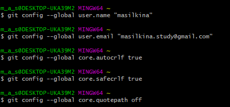
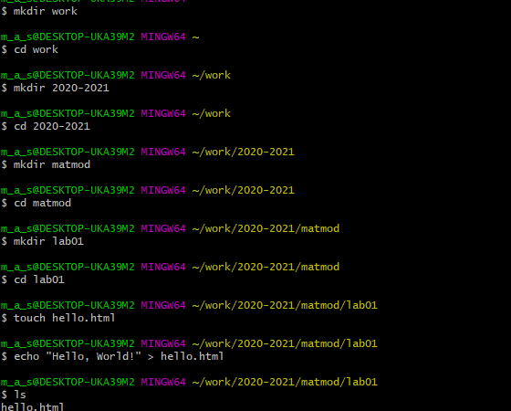
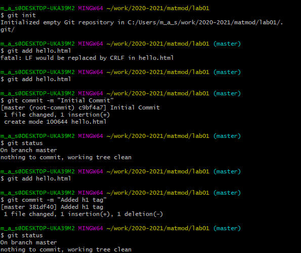
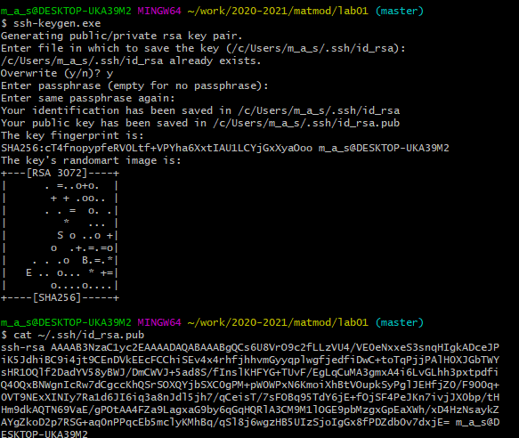
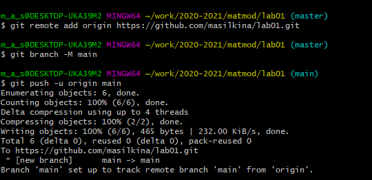
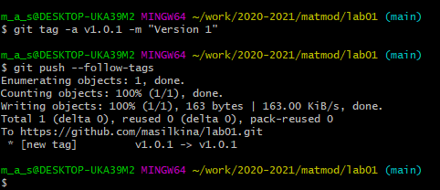

---
# Front matter
lang: ru-RU
university: "Российский университет дружбы народов"
title: "Отчёт по лабораторной работе 1"
discipline: "Математическое моделирование"
group: "НКНбд-01-18"
author: "Силкина Мария Александровна"
teacher: "Кулябов Дмитрий Сергеевич"

# Formatting
toc-title: "Содержание"
toc: true # Table of contents
toc_depth: 2
lof: true # List of figures
lot: true # List of tables
fontsize: 12pt
linestretch: 1.5
papersize: a4paper
documentclass: scrreprt
polyglossia-lang: russian
polyglossia-otherlangs: english
mainfont: PT Serif
romanfont: PT Serif
sansfont: PT Sans
monofont: PT Mono
mainfontoptions: Ligatures=TeX
romanfontoptions: Ligatures=TeX
sansfontoptions: Ligatures=TeX,Scale=MatchLowercase
monofontoptions: Scale=MatchLowercase
indent: true
pdf-engine: lualatex
header-includes:
  - \linepenalty=10 # the penalty added to the badness of each line within a paragraph (no associated penalty node) Increasing the value makes tex try to have fewer lines in the paragraph.
  - \interlinepenalty=0 # value of the penalty (node) added after each line of a paragraph.
  - \hyphenpenalty=50 # the penalty for line breaking at an automatically inserted hyphen
  - \exhyphenpenalty=50 # the penalty for line breaking at an explicit hyphen
  - \binoppenalty=700 # the penalty for breaking a line at a binary operator
  - \relpenalty=500 # the penalty for breaking a line at a relation
  - \clubpenalty=150 # extra penalty for breaking after first line of a paragraph
  - \widowpenalty=150 # extra penalty for breaking before last line of a paragraph
  - \displaywidowpenalty=50 # extra penalty for breaking before last line before a display math
  - \brokenpenalty=100 # extra penalty for page breaking after a hyphenated line
  - \predisplaypenalty=10000 # penalty for breaking before a display
  - \postdisplaypenalty=0 # penalty for breaking after a display
  - \floatingpenalty = 20000 # penalty for splitting an insertion (can only be split footnote in standard LaTeX)
  - \raggedbottom # or \flushbottom
  - \usepackage{float} # keep figures where there are in the text
  - \floatplacement{figure}{H} # keep figures where there are in the text
---

# Цель работы

Цель данной лабораторной работы заключается в изучении и применении основ Git и Markdown.

# Задание

К заданиям данной лабораторной работы относится:
1. Создать логин на Github.
2. Создание каталогов.
3. Создание и загрузка SSH-ключей.
4. Применение коммитов.
5. Загрузка каталогов.
6. Создание релиза на Github.
7. Создание отчета и презентации с помощью Markdown.
8. Преобразовать формат md в pdf и docx.

# Выполнение лабораторной работы

В начале данной лабораторной работы я создала профиль на гитхаб, установила имя и электронную почту, параметры установки окончания строк и установка отображения Unicode. (рис. 1)

{ Рисунок 1 }

Далее, я создала директории, как требуется в описани рабочего пространства. (рис.2)

{ Рисунок 2 }

Следующим шагом, я сделала из каталога репозиторий, изменила изначальный файл и закоммитила изменения. (рис.3)

{ Рисунок 3 }

Далее я загрузила и подключила SSH-ключ. (рис.4)

{ Рисунок 4 }

Потом я загрузила репозиторий на Github, следуя инструкции. (рис.5)

{ Рисунок 5 }

В конце, я сделала релиз при помощи тегов. (рис.6).

{ Рисунок 6 }

# Выводы

При помощи данной лабораторной работы я получила знания и навыки пользования Git, я научилась создавать репозитории, коммитить и делать релизы. Также я получила навыки оформления отчетов и презентаций при помощи Markdown.
